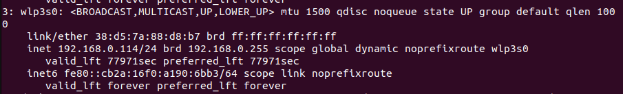
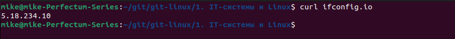

# Домашнее задание к занятию "`1.1. Обзор IT-систем: принципы работы современных компьютеров`"

### Кейс 1.

Как вы думаете, какие принципиальные отличия есть между:

- компьютером секретаря:

`необязательны мощные процессор и видеокарта. RAM — достаточно 4ГБ. Из прикладного ПО преимущественно — офисный пакет(MS Office, LibreOffice)`

- рабочей станцией для работы с 3d графикой: 

`мощная видеокарта и процессор. RAM не менее 8ГБ. ПО: дизайнерские пакеты обработки видео и графики (например, Adobe PS)`
    
- файловым сервером 

`большой объем скоростных накопителей информации. Как правило, расположен в серверной комнате, в стойке`

- сервером, выполняющим роль маршрутизатора для выхода в интернет 

`несколько сетевых адаптеров с большой пропускной способностью. Специальное сетевое ПО для маршрутизации и мониторинга работы сети`

---

### Кейс 2.

Чем отличаются чипсет и процессор? 

`Процессор — главный компонент компьютера, отвечающий за вычислительные операции. Как правило, является дискретным устройством. Устанавливается на материнскую плату в специальный соккет.`

`Чипсет — встроенный в материнскую плату набор микросхем, отвечающий за взаимодействие различных компонентов компьютера и его функциональность.`

---

### Кейс 3.

Какой вариант хранилища вы бы выбрали для задач ниже?

1. Хранилище архива проектов, расположенное на диске с общим доступом, не критично к скорости чтения, большого объёма, должно быть доступно круглосуточно

`RAID-массив`

2. Сервер баз 1С с высокими требованиями по скорости доступа к диску

`SSD или RAID настроенный повышенную скорость взаимодействия.`

3. Системный диск (на котором установлена операционная система) рабочей станции, объём небольшой

`M.2, SSD`

4. Хранилище ежемесячных резервных копий большого объёма, носители которого должны храниться вне офиса на случай пожара и других непредвиденных ситуаций. Подлежат использованию к крайнем случае

`RAID-массив, ленточная библиотека в DATA-центре`

5. Второй диск на рабочей станции, на котором пользователь хранит данные второстепенной важности

`HDD`

---

### Кейс 4.

Опишите процесс загрузки компьютера с момента нажатия кнопки включения и до появления рабочего стола. Опишите этот процесс настолько детально, насколько вы это понимаете.

[Схема загрузки ОС](System_boot.jpg)

---

### Кейс 5.

Попробуйте узнать IP-адрес вашего компьютера из консоли (командной строки) с помощью команды `ipconfig` или `ifconfig/ip a` в зависимости от ОС, либо через графический интерфейс.

Совпадает ли он с [адресом, который видит, например, Яндекс](https://yandex.ru/internet/) или `curl ifconfig.io`?

Как вы думаете, почему?

`Выведены приватный/серый и публичный/белый IP-адреса хоста`

---

### Кейс 6.

Какой процессор вы выберете - Intel Core i5 9600K или Intel Core i7 7700K? 

`Core I5-9600K`

Почему? 

`Цена. Больше ядер(6). Производительность не на много ниже(@3.7GHz против @4.2GHz). Более современный(2018 год против 2017-го).`

Изменится ли мнение после просмотра [этого сравнения](https://cpu.userbenchmark.com/Compare/Intel-Core-i5-9600K-vs-Intel-Core-i7-7700K/4031vs3647)? Опишите ход ваших мыслей. 

Какую материнскую плату вы выберете для выбранного процессора?

`Материнская плата ASUS Prime B360M-K. Хорошее соотношение: цена/качество + производитель.`