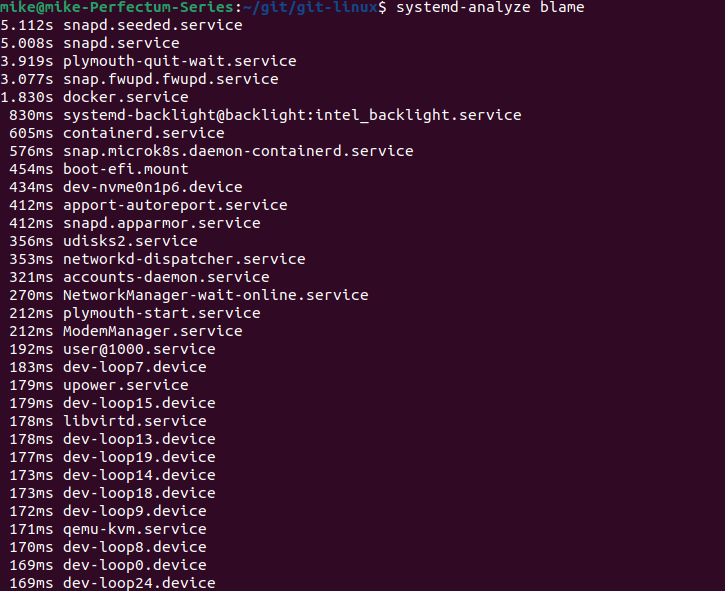
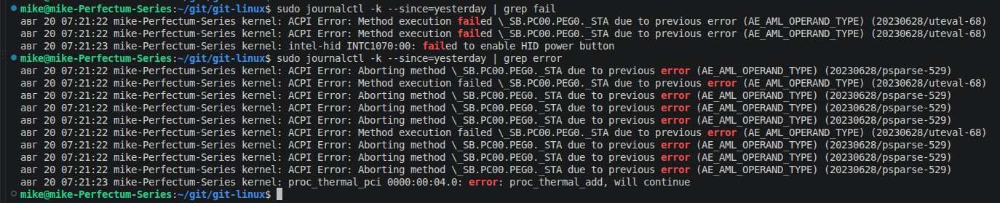
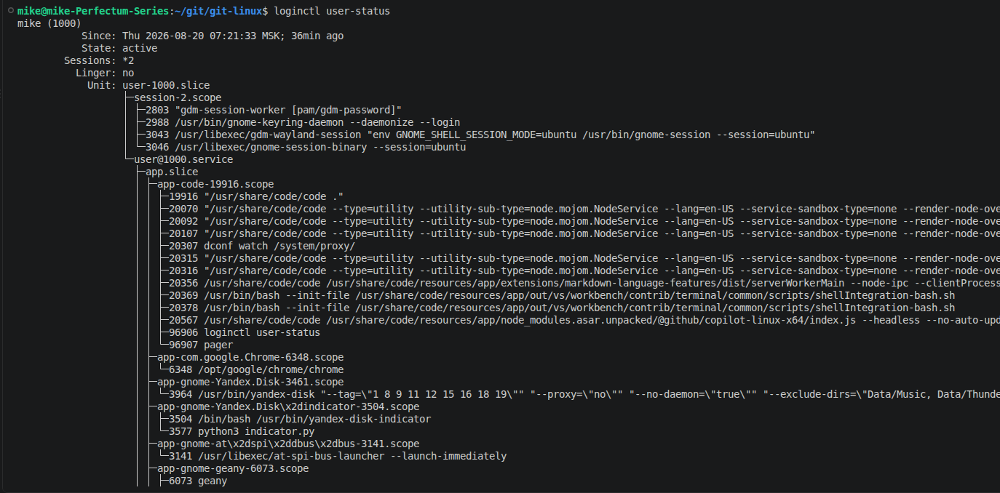
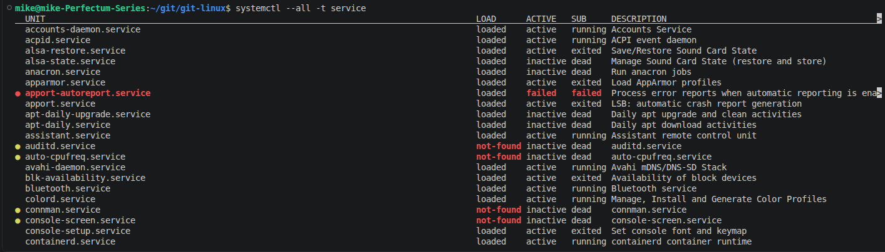

# Домашнее задание к занятию "`Загрузка ОС. init. Systemd`"


### Задание 1.

На лекции мы рассмотрели загрузку ядра и дополнительных модулей. Почему сразу не сделано ядро со всеми модулями? Так бы смогли избавиться от `initrd` …

- `Если добавить в ядро все модули сразу, оно разрастется до огромных размеров`
- `Не все версии модулей совместимы друг с другом`

---

### Задание 2

Существует ли возможность загрузить несколько ядер ОС?

Например, ОС Linux является многопользовательской и разные пользователи хотят загрузить разные версии ядра.

`Нет. Ядро загружается одно`

---

### Задание 3

Выполните `systemd-analyze blame`.

Укажите, какие модули загружаются дольше всего.



---

### Задание 4

Какой командой вы посмотрите ошибки ядра, произошедшие начиная со вчерашнего дня?

```
sudo journalctl -k --since=yesterday | grep fail
sudo journalctl -k --since=yesterday | grep error
```


---

### Задание 5

Запустите команду `loginctl user-status`.

Что выполняет, для чего предназначена эта утилита?



`Информация о сеансе пользователя, списке процессов, служб и зависимостей запущенных во время данного сеанса.`

---

### Задание 6

Есть ли у вас на машине службы, которые не смогли запуститься? Как вы это определили?

```
systemctl --all -t service

systemctl –failed
```


---

### Задание 7*

Существует такой вид виртуализации как контейнеризация: контейнеры создаются на уровне ОС и работают в изолированных пространствах.

**Вопрос**: что произойдет, если в хостовой ОС установлен `upstart`, а в запущенном контейнере - `systemd`?

`Запустить systemd внутри контейнера при хостовом upstart не получится или он будет работать некорректно. Контейнер не получит права инициализации системы, так как systemd требует специального окружения (namespaces, cgroups и PID 1). Он не сможет управлять службами внутри контейнера.`

---

### Задание 8**

Можно ли с помощью systemd отмонтировать раздел/устройство?

`Да, с помощью systemd можно отмонтировать раздел или устройство. Для этого используются встроенные команды systemctl stop, специальная утилита systemd-umount (или systemd-mount --umount), либо остановка соответствующего юнита монтирования.`


