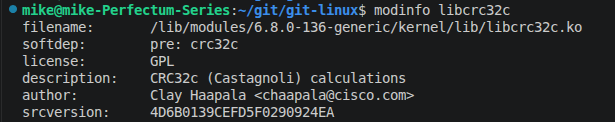
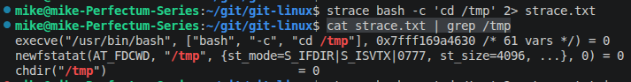
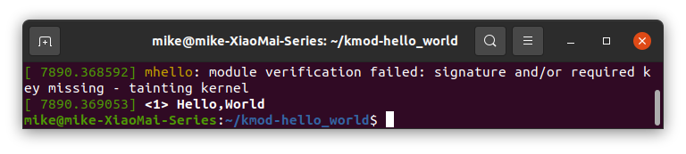

# Домашнее задание к занятию "`2.8 Ядро операционной системы`"


### Задание 1.

При каких событиях выполнение процесса переходит в режим ядра?

`Существует 2 события, при которых выполнение переходит в режим 
ядра:`

- `системные вызовы: поступают от пользовательских программ и касаются работы с устройствами, памятью и т.п.`
- `аппаратные прерывания: сигнализируют об окончании какого-либо действия со стороны устройства или о возникшей на устройстве ошибке.`

---

### Задание 2

Найдите имя автора модуля `libcrc32c`.

```
modinfo libcrc32c
```


---

### Задание 3

Используя утилиту strace выясните какой системный вызов использует команда `cd`.

Примечание: она не является внешним файлом, но для наших целей можно схитрить: `strace bash -c 'cd /tmp'`. Если вывод кажется слишком перегруженным, подумайте, что можно сделать, чтобы оставить в нём только релевантную информацию?

```
strace bash -c 'cd /tmp' 2> strace.txt
cat strace.txt | grep /tmp
```


`Системный вызов chdir()`

---

### Задание 4*

Соберите свой модуль и загрузите его в ядро.

*Примечание:* лучше использовать чистую виртуальную машину, чтобы нивелировать шанс сломать систему.

1. Установим необходимые пакеты:

```
apt-get install gcc make linux-headers-$(uname -r)
```

2. Создаем файл модуля:

```
mkdir kmod-hello_world
cd kmod-hello_world/
touch ./mhello.c
```
`Содержимое файла mhello.c:`
```
#define MODULE
#include <linux/module.h>
#include <linux/init.h>
#include <linux/kernel.h>

MODULE_LICENSE("GPLv3");

int init_module(void){
    printk("<1> Hello,World\n");
    return 0;
}

void cleanup_module(void){
    printk("<1> Goodbye.\n");
}
```
3. Создаем Makefile: `touch ./Makefile`
```
obj-m += mhello.o

hello-objs := mhello.c

all:
	make -C /lib/modules/$(shell uname -r)/build/ M=$(PWD) modules

clean:
	make -C /lib/modules/$(shell uname -r)/build/ M=$(PWD) clean
```
*Обратите внимание, что отступы перед `make` - это табуляция, а не пробелы. Для синтаксиса Makefile это важно.*

4. Собираем модуль и устанавливаем его с помощью insmod.

```
make all
insmod path/to/module.ko
```

В качестве ответа приложите скриншот вывода установки модуля в `dmesg`.




