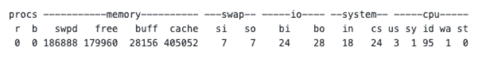
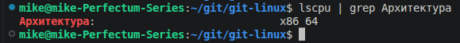
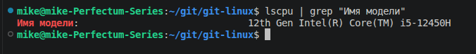
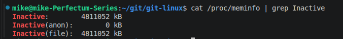
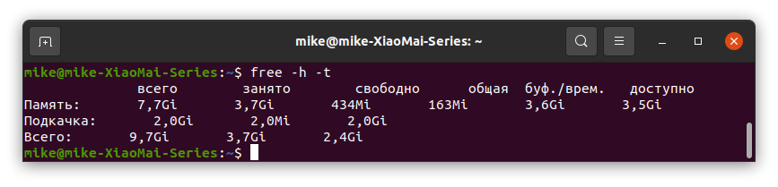
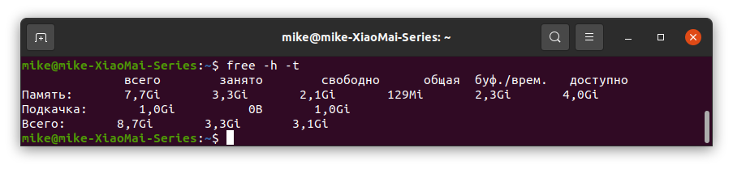
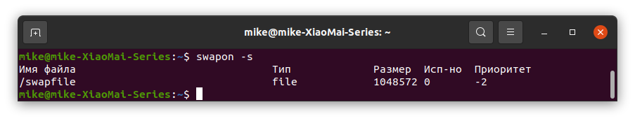

# Домашнее задание к занятию "`Память, управление памятью`"


### Задание 1.

Что происходит с оперативной памятью во время перехода ПК в:

- сон (suspend)

`Спящий режим энергозависим. Все данные остаются в оперативной памяти.`

- гибернацию (hibernate)

`Во время гибернация RAM сохраняет содержимое на жесткий диск. Подача электричества не требуется.`

---

### Задание 2

В лекции не была упомянута одна известная команда для получения информации о нагрузке на компьютер и в частности на ОЗУ.

Ее вывод выглядит примерно вот так:



Как называется эта команда? Что такое si и so в примере на картинке?

`Команда vmstat:`

`si - swap input`

`so - swap output`

---

### Задание 3

Приведите 3 команды, которые выведут на экран следующее:

1. Архитектуру ПК
```
lscpu | grep Архитектура
```


2. Модель процессора
```
lscpu | grep "Имя модели"
```


3. Количество памяти, которая уже не используется процессами, но еще остается в памяти(ключевое слово - inactive).
```
cat /proc/meminfo | grep Inactive
```


*Примечание: при выполнении задания предполагается использование конструкции “{команда} | grep {параметр для фильрации вывода}”*

---

### Задание 4

1. Создайте скрин вывода команды `free -h -t`



2. Создайте swap-файл размером 1Гб



3. Добавьте настройку чтобы swap-файл подключался автоматически при перезагрузке виртуальной машины (подсказка: необходимо внести изменения в файл /etc/fstab)
4. Создайте скрин вывода команды free -h -t
5. Создайте скрин вывода команды swapon -s



6. Измените процент свободной оперативной памяти, при котором начинает использоваться раздел подкачки до 30%. Сделайте скрин внесенного изменения.


---

### Задание 5*

Найдите информацию про tmpfs.

Расскажите в свободной форме, в каких случаях уместно использовать эту технологию.

Создайте диск tmpfs (размер выберите исходя из объёма ОЗУ на ПК: 512Мб-1Гб), смонтируйте его в директорию /mytmpfs.

В качестве ответа приведите скрин вывода команды df- h до и после монтирования диска tmpfs.
