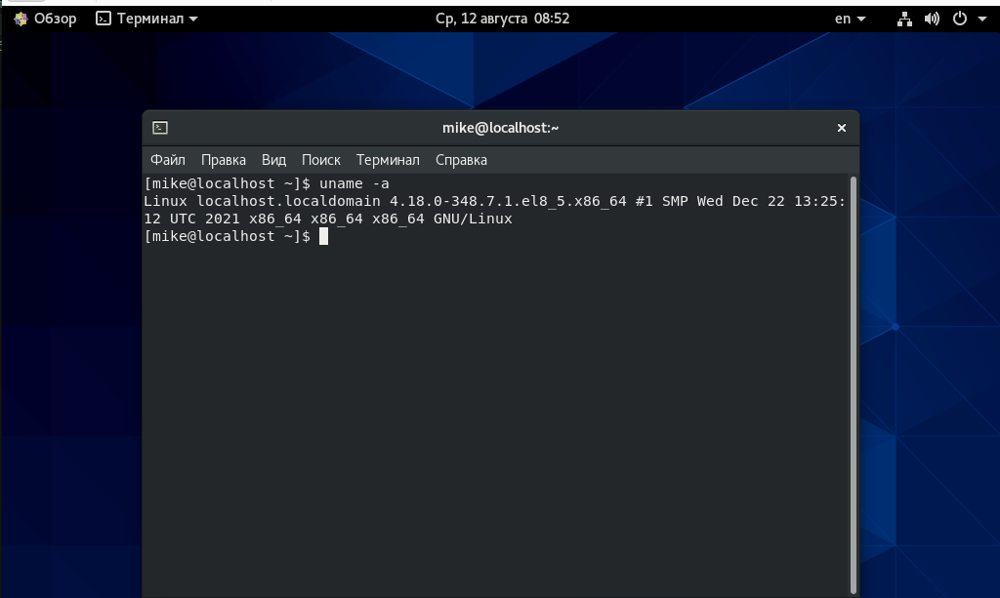
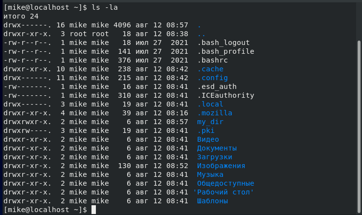
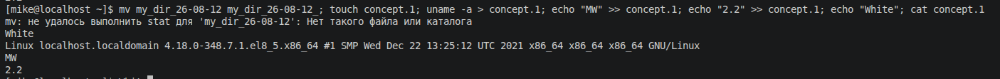
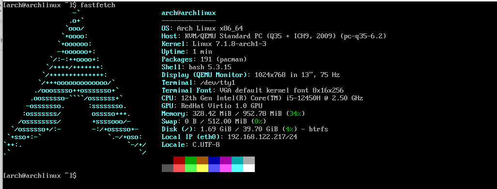

# Домашнее задание к занятию "`2.2 Основы работы с командной строкой`"


### Задание 1.

Подготовим рабочее пространство

1. Скачайте с сайта [VirtualBox](https://www.virtualbox.org/) и установите на свой компьютер Virtual Box.

2. Создайте новую виртуальную машину.

Памяти лучше выделить не менее 2ГБ, все остальные настройки по умолчанию.

Выберите файл iso-образа CentOS Stream:

3. Скачайте CentOS Stream 8 (boot образа достаточно, dvd не обязательно скачивать) с [зеркала Яндекса](https://mirror.yandex.ru/centos/8-stream/isos/x86_64/) или любого другого зеркала, ссылки на [официальном сайте](https://www.centos.org/download/).

4. Установите CentOS Stream на вашу виртуальную машину.

- Если выбрали русский язык, нажмите на символ клавиатуры с подписью ru, чтобы переключить на латиницу.
- Network & Host M… (Сеть и и…) - нажмите кнопку возле “Ethernet”, чтобы надпись под “Ethernet” стала “подключено”
- Инсталяционный источник: https:// и vault.centos.org/8.5.2111/BaseOS/x86_64/os/
- Опционально: Software Selection (Выбор программ): GNOME - для того, чтобы получить графический интерфейс. (кириллица без графического интерфейса или дополнительных манипуляций не будет отображаться!)
- Time & Date - выберите ваш часовой пояс
- Installation Destination (Установ…) - сразу нажать “готово”
- User Creation (Создание пользователя):
  - Full name (Полное имя) - имя студента
  - User name (Имя пользователя) - ваш логин
  - Make this user administrator (Сделать этого пользователя администратором) - отметьте флажок
  - Password (Пароль) - ваш пароль
  - Confirm password (Подтвердить пароль) - повторите пароль
- Запустите виртуальную машину.

---

### Задание 2.

Подключитесь к виртуальной машине, откройте консоль и выведите на экран информацию о дистрибутиве.

```
uname -a
```



---

### Задание 3.

Создайте каталог в домашнем каталоге вашего пользователя.
```
mkdir my_dir
```

Выведите на экран содержимое домашнего каталога, включая права на файлы, скрытые и системные файлы.
```
ls -la
```


---

### Задание 4.

Переименуйте созданный вами каталог, добавив к нему текущую дату в формате ГГ-ММ-ДД;

Создайте в нем файл с именем concept.1, который будет содержать следующую информацию:

- информация о дистрибутиве,
- ваше имя и фамилия,
- номер лекции;

Выведите на экран строку с вашей фамилией и содержимое созданного файла. Выполните все в одну строку.
```
mv my_dir_26-08-12 my_dir_26-08-12_; touch concept.1; uname -a > concept.1; echo "MW" >> concept.1; echo "2.2" >> concept.1; echo "White"; cat concept.1
```


---

### Установите обновления пакетов.

Установите на свою виртуальную машину `Midnight Commander` и `Vim` одной командой.

```
# Обновить репозитории:
cd /etc/yum.repos.d/
sed -i 's/mirrorlist/#mirrorlist/g' /etc/yum.repos.d/CentOS-*
sed -i 's|#baseurl=http://mirror.centos.org|baseurl=http://vault.centos.org|g' /etc/yum.repos.d/CentOS-*
yum update -y

# Установить программы:
sudo dnf install mc vim
```

---

### Задание 6.*

Установите на виртуальную машину **Arch Linux**.

`Скачать `[образ диска для VM с Arch Linux](https://gitlab.archlinux.org/archlinux/arch-boxes/-/packages)

`Login: arch`

`Password: arch`

Установите программу `neofetch`.

`Neofetch удалена из репозитория Arch. Ставлю fastfetch:`
```
sudo pacman -S fastfetch
```

Выполните на ней задание 2 (воспользуйтесь `neofetch` для вывода информации о системе).

