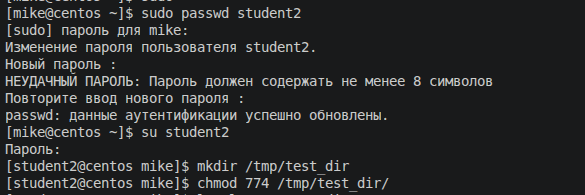
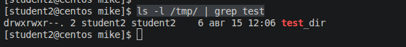
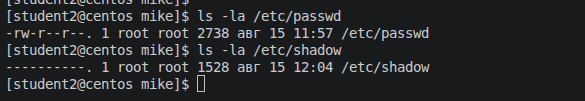

# Домашнее задание к занятию "`3.4. Управление пользователями`"


### Задание 1.

Создайте пользователя `student1` с оболочкой bash, входящего в группу `student1`.

Создайте пользователя  `student2`, входящего в группу `student2`.

```
sudo adduser student1
sudo adduser student2
cat /etc/passwd | grep student
```


---

### Задание 2.

Создайте в общем каталоге (например, /tmp) директорию и назначьте для неё полный доступ со стороны группы `student2` и доступ на чтение всем остальным

```
# Задать пароль ползователю student2:
sudo passwd student2

# Переключиться на пользователя student2:
su student2

# Создать директорию:
mkdir /tmp/test_dir

# Задать необходимые права:
chmod 774 /tmp/test_dir

# Просмотр прав директории:
ls -l /tmp/ | grep test
```



---

### Задание 3.

Какой режим доступа установлен для файлов `/etc/passwd` и `/etc/shadow`?

```
ls -la /etc/passwd
ls -la /etc/shadow
```


Объясните, зачем понадобилось именно два файла?

`/etc/passwd - для создания пользовтелей и их аттрибутов`

`/etc/shadow - для хранения хэшей праолей пользователей. Доступ к данному файлу ограничен. Изменение паролей осуществляется с применением аттрибута setuid к утилите passwd. Это позволяет запускать ее от лица пользователя root`

---

### Задание 4.

Удалите группу `student2`, а пользователя `student2` добавьте в группу `student1`.

```
sudo -i

# Принудительно задать пользователю student2 группу student1
usermod -g student1 student2

# Удалить группу student1
groupdel student2
```

---

### Задание 5*.

Создайте в общем каталоге (например, /tmp) директорию и назначьте для неё полный доступ для всех, кроме группы `student1`. Группа `student1` не должна иметь доступа к содержимому этого каталога.

```
 sudo passwd student1

 su student1

 mkdir /tmp/new_dir

 exit

 sudo -i

 chmod u=rwx,g=---,o=rwx /tmp/new_dir/

 ls -la /tmp | grep new_dir

 su student2

 ls /tmp/new_dir/   # Доступа не будет, т.к. student2 входит в группу student1
```
