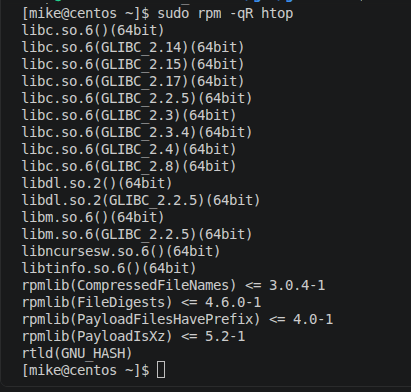
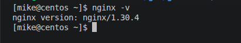

# Домашнее задание к занятию "`2.5 Управление пакетами`"


### Задание 1.

Опишите плюсы работы с пакетным менеджером и репозиторием.

- Как вы считаете, в чем основные достоинства такой организации ПО?

`Плюсом пакетных менеджеров является установка программ из маленьких пакетов создавая зависимости, которые могут совместно использовать общие библиотеки, что ведёт к экономии места на жестком диске и экономии RAM.`

`Плюсом репозитория является централизованное хранение различных пакетов. Нет необходимости в поиске ресурсов для загрузки софта.`

- Есть ли минусы?

`В репозиториях не всегда присутствуют свежие версии программ`

---

### Задание 2.

При подключении стороннего репозитория надо выполнить ряд определенных действий.

- Каких?

`Необходимо править конфигурационные файлы репозиториев.Скачать пакеты репозитория(например, с помощью wget). Установить репозиторий. Для некоторых репозиториев требуется установить GPG-ключ, указать адрес ресурса. `

- В чем опасность такого способа распространения ПО?

`Минусы сторонних репозиториев: нестабильность свежих версий ПО; низкая безопасность(возможность занести вирус)`

- Как это решается?

`Решением данной проблемы является использование GPG-ключей и отказ от подключения непроверенных репозитеориев.`

---

### Задание 3.

Перейдем к практике.

1. Запустите свою виртуальную машину.
2. Найдите в репозиториях и установите одной командой пакет `htop`.

```
# Включить репозиторий EPEL:
sudo dnf install https://dl.fedoraproject.org/pub/epel/epel-release-latest-8.noarch.rpm

# Просмотр доступных пакетов htop:
sudo dnf search htop

# Установка htop:
sudo dnf install htop

# Исполняемый файл программы - /usr/bin/htop
```
Какие зависимости требует `htop`?

```
rpm -qR htop
```


---

### Задание 4.

Подключите репозиторий [nginx-stable](https://nginx.org/en/linux_packages.html#RHEL-CentOS) и установите nginx оттуда. Возможно придётся его включить.

`Установка требуемых утилит:`
```
sudo yum install yum-utils
```
`Создание файла конфигурации репозитория /etc/yum.repos.d/nginx.repo:`
```
[nginx-stable]
name=nginx stable repo
baseurl=https://nginx.org/packages/centos/$releasever/$basearch/
gpgcheck=1
enabled=1
gpgkey=https://nginx.org/keys/nginx_signing.key
module_hotfixes=true

[nginx-mainline]
name=nginx mainline repo
baseurl=https://nginx.org/packages/mainline/centos/$releasever/$basearch/
gpgcheck=1
enabled=0
gpgkey=https://nginx.org/keys/nginx_signing.key
module_hotfixes=true
```
`Установка nginx:`
```
sudo yum install nginx
```

Приложите скриншот содержимого файла, с конфигурацией репозитория.

При помощи команды `nginx -v` посмотрите, какая версия nginx установлена. 



Проверьте, какие версии nginx доступны с помощью `dnf list --showduplicates --all nginx`.


---

### Задание 5.

1. Перечислите менеджеры пакетов, кроме тех, о которых говорилось на лекции. В каких дистрибутивах они работают?

- Portage - система управления пакетами в Gentoo или Calculate Linux.
- Zypper - OpenSuse.
- Snap
- Flatpak

2. Есть ли альтернативные менеджеры для тех, которые разбирались на лекции?

`Bauh объединяет Flatpak, Snap, AppImage, Arch AUR, Debian, Web.`


