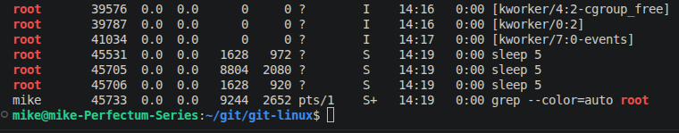

# Домашнее задание к занятию "`2.6 Процессы, управление процессами`"


### Задание 1.

Объясните, что делает команда:

```
ps aux | grep root | wc -l >> root
```

Не захватывает ли она чего лишнего? Можно ли решить эту задачу лучше / правильнее?

- `ps aux` - отобразить все запущенные процессы
- `grep root` - выбрать строки, содержащие подстроку "root"
- `wc -l >> root` - подсчитать количество строк и дописать их в файл root

`Данная команда, помимо процессов запущенных от лица root, захватит процессы, запущенные от имени текущего пользователя и сервисов, так как эти строки также содержит подстроку "root":`



`Для кооректного подсчета процессов, запущенных от имени root, следует выполнить команду:`

```
ps -u root --no-headers | wc -l
```
`--no-headers - удаляет из выборки заголовок таблицы`

---

### Задание 2

Напишите команду, которая выводит все запущенные процессы пользователя root в файл “*userrootps*”.

```
ps -u root > userrootps
```
---

### Задание 3

Начинающий администратор захотел вывести все запущенные процессы пользователя с логином “2” в файл “*user2ps*”.

Для этого он набрал команду:

```
ps -U 2> user_2_ps
```

Затем, он аналогично повторил для пользователя с логином “5” вывод в файл “*user_5_ps”*:

```
ps -U 5> user_5_ps
```

**Вопрос:**

Почему вывод этих команд и содержимое файлов сильно отличаются друг от друга? Как должны выглядеть правильные команды?

Примечание:

Если у вас в системе нет пользователей “2” и/или “5” (это нормальная ситуация), то утилита ps выводит только одну строку:

PID TTY TIME CMD

`Обе команды звершатся с ошибой. В случае с "2>" ошибка будет записана в файл, так как "2>" означает стандартный вывод ошибок. В случае с "5>" ошибка будет выведена на экран.`

`Правильный синтаксис команд предполагает пробел перед знаком ">":`

```
ps -U 2 > user_2_ps
ps -U 5 > user_5_ps
```

---

### Задание 4*

Сформируйте команду `ps` так, чтобы она выводила процессы, запущенные только от имени пользователя `root`, со следующими полями: команда (командная строка), id процесса, потребление процессора, потребление резидентной памяти (rss). Сортировка должна быть по потреблению памяти (rss), в обратном порядке (внизу - наибольшее потребление).

Команда должна содержать только `ps` и опции к ней, обрабатывать вывод другими командами нельзя.

```
ps -U root -o cmd,pid,cpu,rss --sort +rss
```


